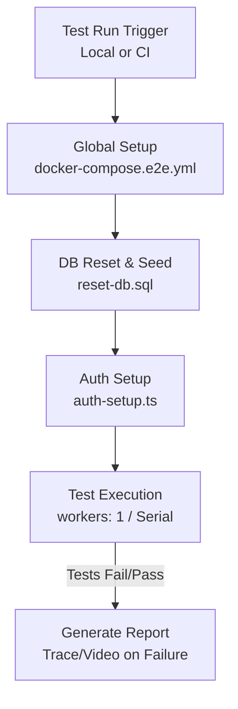

# FlowDesk — Freelance & Marketing Agency Platform

FlowDesk is a full-stack web platform that connects clients with skilled freelancers. Clients can browse available services, book them directly, reach out to freelancers for their projects, and manage everything from one place. The platform includes a powerful admin dashboard for managing users, services, categories, projects, earnings, and more.

---

## Features

### For Clients
- Browse and search services by category
- Book a service directly from the platform
- Contact freelancers and submit project requests
- Secure login and role-based access

### For Freelancers
- Manage incoming project requests
- Dedicated freelancer panel

### For Admins
- Full dashboard with management of:
  - Categories & Services
  - Users & Freelancers
  - Projects & Requests
  - Earnings & Settings
- Marketplace and Blog sections

---

## Tech Stack

| Layer | Technology |
|---|---|
| Framework | React 19 + Vite |
| Styling | Tailwind CSS 4, DaisyUI, Headless UI, Radix UI |
| State Management | Zustand |
| Data Fetching | TanStack Query (React Query) + Axios |
| Routing | React Router DOM 7 |
| Animations | GSAP |
| Drag & Drop | @dnd-kit |
| Icons | Lucide React, Remix Icons, Heroicons |

---

## Getting Started

### Prerequisites
- Node.js >= 18
- npm or yarn


### Build for Production

```bash
npm run build
npm run preview
```

---

## E2E Testing Architecture

FlowDesk uses an enterprise-grade Playwright E2E setup. Because this is a multi-tenant application with a complex relational database, tests are designed to execute against a fully seeded backend running inside isolated Docker containers.

### Key Components

- **Playwright Configuration** ([`playwright.config.ts`](file:///c:/Users/ayoub/Desktop/PERSONAL%20DEV/SpringBootUltimate/FlowDeskProject/Client/playwright.config.ts)): Configures the test environment. In CI mode (`CI=true`), tests have `retries=1` and forbid `.only` blocks. Locally, the dev server is reused. Workers are forced to `1` to avoid database concurrency issues in PostgreSQL since tests share a single DB instance.
- **Global Setup & Infrastructure** ([`tests/global-setup.ts`](file:///c:/Users/ayoub/Desktop/PERSONAL%20DEV/SpringBootUltimate/FlowDeskProject/Client/tests/global-setup.ts) & [`docker-compose.e2e.yml`](file:///c:/Users/ayoub/Desktop/PERSONAL%20DEV/SpringBootUltimate/FlowDeskProject/Client/docker-compose.e2e.yml)): Orchestrates a clean testing environment. It verifies or starts a PostgreSQL database and Spring Boot backend via Docker, then resets the database before the test suite runs. 
- **Authentication State** ([`tests/e2e/admin/setup/auth-setup.ts`](file:///c:/Users/ayoub/Desktop/PERSONAL%20DEV/SpringBootUltimate/FlowDeskProject/Client/tests/e2e/admin/setup/auth-setup.ts)): Automates the login flow for administrative roles and saves the session to `playwright/.auth/user.json` to be reused across tests.
- **Database Reset & Seeding** ([`tests/reset-db.sql`](file:///c:/Users/ayoub/Desktop/PERSONAL%20DEV/SpringBootUltimate/FlowDeskProject/Client/tests/reset-db.sql) & [`tests/e2e/fixtures/db.ts`](file:///c:/Users/ayoub/Desktop/PERSONAL%20DEV/SpringBootUltimate/FlowDeskProject/Client/tests/e2e/fixtures/db.ts)): Executed per-suite to clear the database (truncate public tables, restart identities) and inject necessary base roles and demo users.
- **CI Pipeline** ([`.github/workflows/playwright.yml`](file:///c:/Users/ayoub/Desktop/PERSONAL%20DEV/SpringBootUltimate/FlowDeskProject/Client/.github/workflows/playwright.yml)): Automatically triggers on pushes/PRs to main. It runs tests and archives the `playwright-report` (containing HTML report, videos, and traces).
- **Test Structure**: Tests are grouped logically by module (e.g., `tests/e2e/admin/features/`, `tests/e2e/client/`).

### Test Execution Flow



### Running Tests

- **Local Development**: `npm run test` or `npm run test:ui` (Requires Docker desktop to be running to orchestrate DB/Backend).
- **CI Environment**: Automatically runs via GitHub Actions (`Playwright Tests`).

### Design Decisions

1. **Serial Execution (`workers: 1`)**: Tests run serially instead of in parallel. Since the E2E backend interacts with a shared PostgreSQL database, parallel tests could cause race conditions (e.g., one test creating data while another truncates it).
2. **Per-Suite DB Reset**: The database is reset once during `global-setup.ts` rather than per-test. This optimizes test speed while ensuring a deterministic starting state.

---

## Project Structure

```
src/
├── admin/              # Admin dashboard panels and components
├── api/                # Axios API calls (auth, services, categories, projects)
├── client/             # Client panel
├── freelancer/         # Freelancer panel
├── globalState/        # Zustand global auth store
├── landingPage/        # Public-facing landing page (Hero, Banners, NavBar)
├── modals/             # Auth modal and info cards
├── pannelComponents/   # Shared panel UI components
├── utils/              # Protected route utility
└── validationClass/    # TypeScript validation helpers
```

---

## License

This project is fully owned and licensed by **Ayoub Ameur**. All rights reserved. No part of this project may be reproduced, distributed, or used without explicit written permission from the author.

---

## Author

**Ayoub Ameur**  
📧 [ayoubyameury@gmail.com](mailto:ayoubyameury@gmail.com)  
🔗 [linkedin.com/in/ayoub-ameur-772a70362](https://linkedin.com/in/ayoub-ameur-772a70362)
